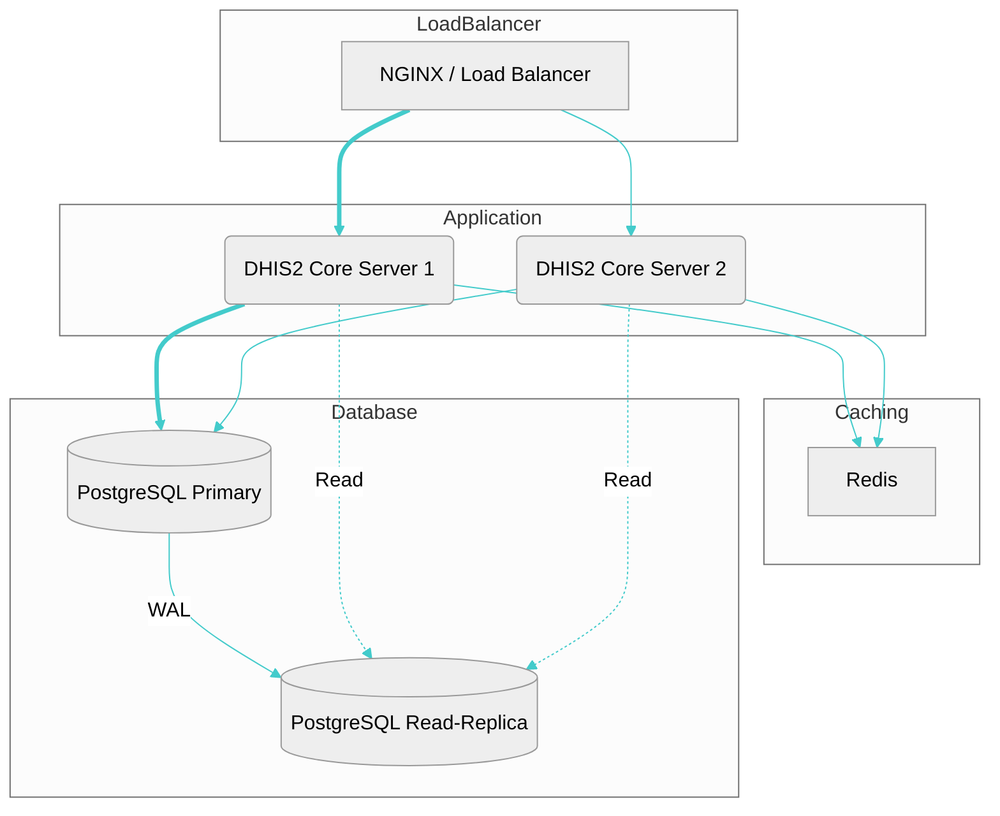

# Clustered DHIS2 with Read Replication

Supports both clustered core (with redis) and PostgreSQL read replicas.

> Note  
> The bitnami postgres image is required for the read replica configuration  
> **In addition:  
> the postgres version is currently limited to 11 which contains the postgis extension**

## Examples

Default DHIS2 core and DB are for the latest dev version; with read replication but only a single DHIS2 core. To use that simply run with:

*I like to tail the logs:*
```
docker compose up -d && docker compose logs -f
```

*If you don't want to tail the logs then simply:*
```
docker compose up -d
```

> Caution  
> Remember that running the latest dev can be unstable and prone to Flyway issues etc, which may prevent it from starting

To scale the core, add that option to the command, e.g.:
```
docker compose up --scale core=2 -d &&  docker compose logs -f
```

To target a specific stable version, I find it convenient to use something like:
```
VER=2.38.5 DHIS2_IMAGE=dhis2/core:${VER} DHIS2_DB_DUMP_URL=https://databases.dhis2.org/sierra-leone/${VER}/dhis2-db-sierra-leone.sql.gz docker compose up --scale core=2 -d &&  docker compose logs -f
```

or, to target a specific development version:
```
VER=2.40 DHIS2_IMAGE=dhis2/core-dev:${VER} DHIS2_DB_DUMP_URL=https://databases.dhis2.org/sierra-leone/${VER}/dhis2-db-sierra-leone.sql.gz docker compose up --scale core=2 -d &&  docker compose logs -f
```

## Shutdown

I like to clean up volumes after using the instance, and before running another:
```
docker compose down; docker volume prune -fa
```


## Scaling overview



