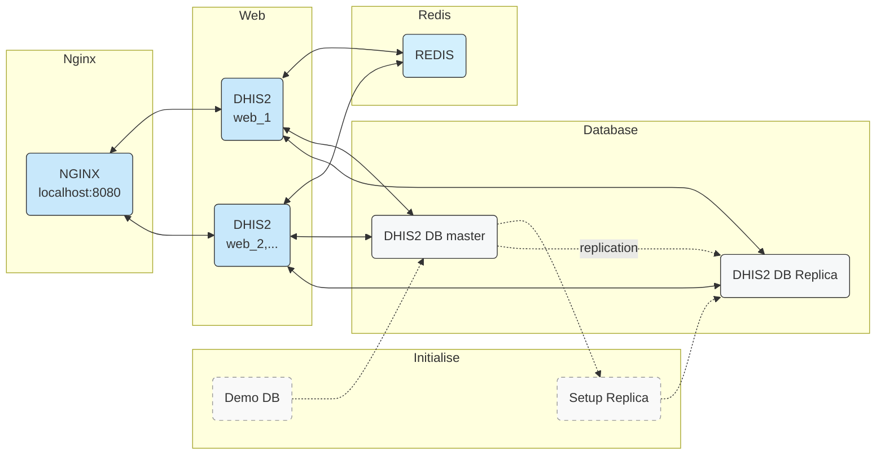

# Web Server Clustering and DB Read-replication

This docker-compose file sets up the following topology:


For horizontal scaling only (scaled to 2 web services by default):

```
docker-compose up -d
```

For DB read-replica (in addition to horizontal scaling):

```
docker-compose --profile replica up -d
```

## Services specific to this topology

**redis**: This service uses the official Redis image and exposes port 6379.

**web**: This service is the main DHIS2 application. It depends on the db and redis services. It scales to 2 instances.

**get_demo_db**: This service is responsible for downloading a database dump file, if it doesn't exist yet, from a provided URL. It uses a BusyBox image.

**db**: This service uses a PostGIS image and is the primary database for the application. It exposes port 5432 and depends on the get_demo_db service to ensure the database dump has been downloaded. This service is configured with a health check that ensures the read replica slots are set up. It also mounts several volumes for data persistence and configuration.

**setup_rr**: This service is used to set up the db-rr read replica. It uses the Docker image and depends on the db service. It copies the read-replica initial backup from the volume used by "db" to the volume used by "db-rr" and is only included in the "replica" profile.

**db-rr**: This is a read replica of the db service, used to offload some of the read queries from the primary database. It exposes port 5433 and depends on the db and setup_rr services. It is only included in the "replica" profile.

**nginx**: This service uses the jwilder/nginx-proxy image to handle the reverse proxy for the application. It depends on the db, web, and redis services, and exposes port 8080.


The services **get_demo_db** and **setup_rr** are designed to run once and then stop, rather than running continuously. They are used to perform setup tasks, specifically downloading a database dump and setting up a database read replica, respectively.
